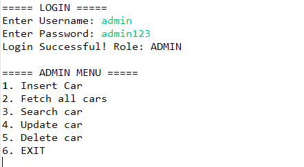
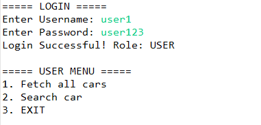
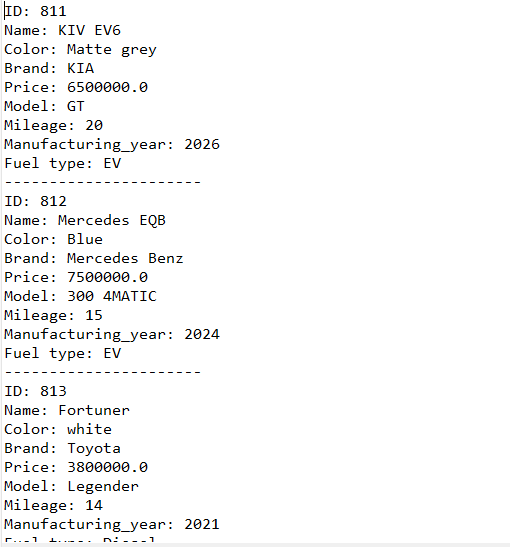
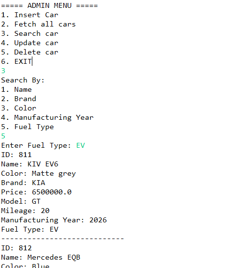
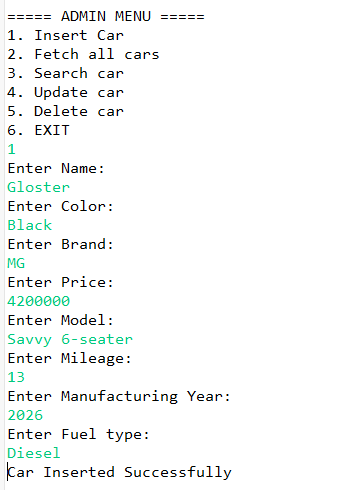
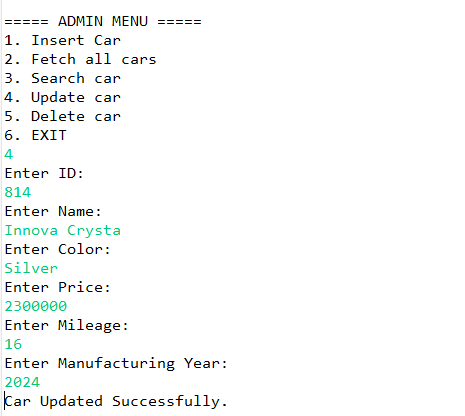
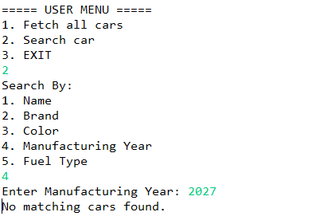
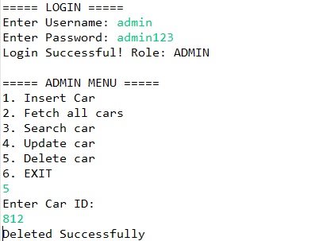

#  Car Management System

The main objective of this ***Car Management System*** project is to develop a system that helps efficiently manage car inventory details along with user access control. In real-world scenarios, it becomes difficult to manually maintain and track large numbers of vehicle records in a structured manner. This system automates the process of storing, updating, searching, and deleting car information, making data management simple, fast, and reliable.

The Car Management System is a console-based application developed using **Java, JDBC, and PostgreSQL**. It also includes a **Role-Based Access Control (RBAC)** system, where administrators have full control over car records, while normal users are restricted to view and search operations only.

This project demonstrates practical implementation of **Core Java**, **JDBC**, **DAO Design Pattern**, **Exception Handling**, and **Database Integration**.

---

##  Features

###  Authentication & Authorization

* User login using username and password
* Role-Based Access Control (RBAC)
* Two user roles:

  * **ADMIN** – Full access to manage cars
  * **USER** – Read-only access

###  Car Management (CRUD)

* Add new car
* View all cars
* Search cars by:

  * Name
  * Brand
  * Color
  * Manufacturing Year
  * Fuel Type
* Update existing car details
* Delete car records

###  Database Features

* PostgreSQL database integration using JDBC
* Database configuration through `db.properties`
* SQL schema and sample data scripts
* PreparedStatement used to prevent SQL Injection

###  Exception Handling

* Custom exception (`CarNotFoundException`)
* Validation using SQL constraints
* Graceful handling of invalid operations

---

---

# 📸 Application Screenshots

###  Admin

Shows all CRUD operations available to administrators.



---

###  User

Read-only access for normal users.



---

###  Fetch all cars

Displays all available car records.



---

### 🔍 Search Car

Search cars by Name, Brand, Color, Manufacturing Year, or Fuel Type.



---

###  Add Car

Add a new car to the inventory (Admin only).



---

###  Update Car

Update existing car details (Admin only).



---

###  Car Not Found

A custom error message when the requested car record is not found.



---

###  Delete Car

Delete a car record by ID (Admin only).



---

#  Tech Stack

| Technology  | Purpose                                             |
| ----------- | --------------------------------------------------- |
| Java        | Core Programming Language                           |
| OOP         | Applied Object-Oriented Programming principles      |
| JDBC        | Database Connectivity between Java and PostgreSQL   |
| PostgreSQL  | Relational Database                                 |
| Eclipse IDE | Development Environment                             |
| SQL         | Used for schema design and database operations      |

---

#  Project Structure

```
CarManagementSystem
│
├── src
│   ├── com.jsp.carmanagementsystem.dao
│   │     ├── CarDao.java
│   │     └── UserDao.java
│   │
│   ├── com.jsp.carmanagementsystem.exception
│   │     └── CarNotFoundException.java
│   │
│   ├── com.jsp.carmanagementsystem.main
│   │     └── Main.java
│   │
│   ├── com.jsp.carmanagementsystem.utility
│   │     └── DBConnection.java
│   │
│   └── db.properties
|
├── sql
│    ├── schema.sql
|    └── data.sql
│
└── README.md
```

---

#  Database Schema

## Cars Table

| Column             | Type                                                                                     |
| ------------------ | ---------------------------------------------------------------------------------------  |
| id                 | SERIAL PRIMARY KEY                                                                       |
| name               | VARCHAR NOT NULL                                                                         |
| color              | VARCHAR NOT NULL                                                                         |
| brand              | VARCHAR NOT NULL                                                                         |
| price              | NUMERIC NOT NULL CHECK(price > 0)                                                        |
| model              | VARCHAR NOT NULL                                                                         |
| mileage            | INTEGER NOT NULL CHECK(mileage >= 0)                                                     |
| manufacturing_year | INTEGER NOT NULL CHECK(manufacturing_year BETWEEN 1990 AND 2026)                         |
| fuel_type          | VARCHAR NOT NULL CHECK (fuel_type IN ('Petrol', 'Diesel', 'CNG', 'EV', 'Hybrid'))        |

## Admin and Users Table

| Column   | Type                           |
| -------- | ------------------------------ |
| id       | SERIAL PRIMARY KEY             |
| username | VARCHAR UNIQUE NOT NULL        |
| password | VARCHAR NOT NULL               |
| role     | VARCHAR NOT NULL               |

---

#  Default Login Credentials

## Admin

```
Username : admin
Password : admin123
```

### Permissions

* Add Car
* View All Cars
* Search Car
* Update Car
* Delete Car

---

## User

```
Username : user1
Password : user123
```

### Permissions

* View All Cars
* Search Car

---

#  Design Highlights

* DAO (Data Access Object) Pattern
* Layered package structure
* Role-Based Authentication
* Custom Exception Handling
* Externalized database configuration
* PreparedStatement for secure SQL execution
* SQL constraints for data integrity

---

#  Application Flow

```
Login
   │
   ▼
Authentication
   │
   ├──────────────┐
   │              │
ADMIN          USER
   │              │
CRUD          View/Search
Operations     Cars
```

---

#  Concepts Demonstrated

* Object-Oriented Programming (OOP)
* JDBC API
* PostgreSQL Integration
* DAO Design Pattern
* Exception Handling
* Role-Based Access Control (RBAC)
* SQL Constraints
* Properties File Configuration
* Package Organization

---
